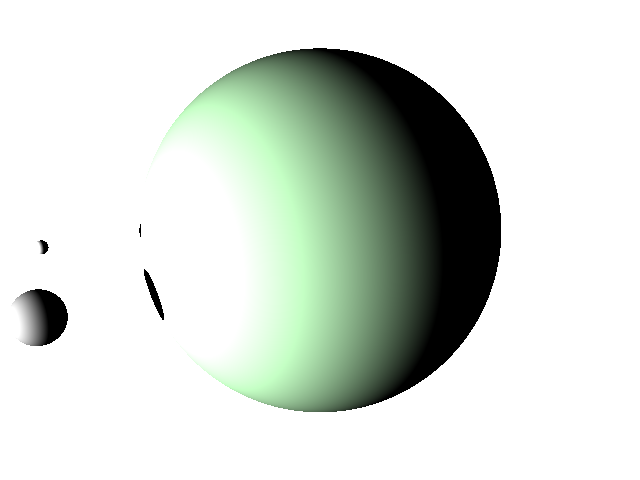

# reiska
A simple Clojure raytracer that doesn't do much yet.

Based on [Scratchapixel's Introduction to Raytracing](https://www.scratchapixel.com/lessons/3d-basic-rendering/introduction-to-ray-tracing/how-does-it-work.html)
and [Literate Raytracer](https://github.com/tmcw/literate-raytracer).

## Examples

### scene1.edn

### scene2.edn

### scene-simple.edn

### scene-simple2.edn

